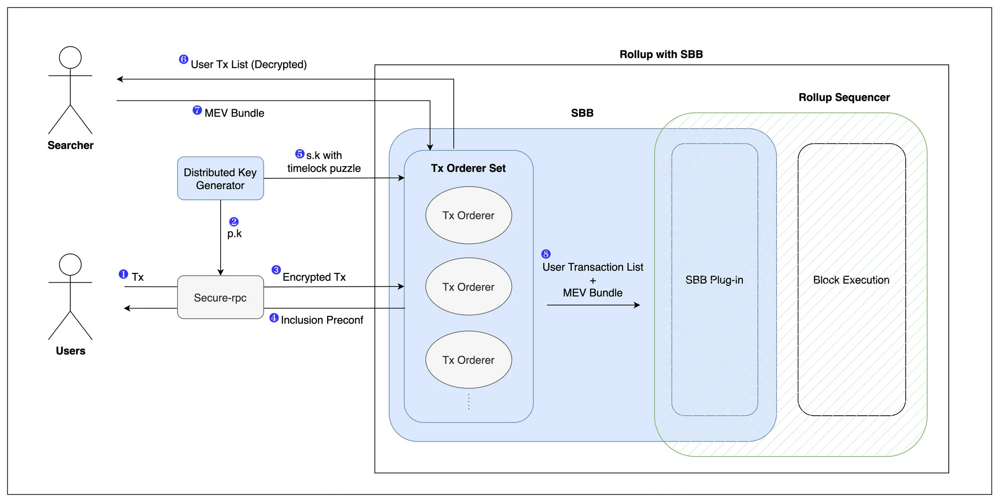

# Encrypted Mempool

## User

Users are entities that submit transactions to the rollup, aiming to safeguard themselves against malicious sequencers.

## User-Specific Actions for Secure Transaction Processing

### **Introduction**

In the context of preventing malicious Miner Extractable Value (MEV) actions, users interact with the shared sequencing layer through a sequence of steps designed to ensure transaction integrity and order. This process involves encryption techniques to protect transactions from being censored or reordered maliciously. Radius uses a cryptographic method called [Practical Verifiable Delay Encryption (PVDE)](https://ethresear.ch/t/mev-resistant-zk-rollups-with-practical-vde-pvde/12677), which relies on a time-lock puzzle to conceal transaction details until a predetermined time is reached.

<figure><figcaption>
<em>User specific actions</em>
</figcaption></figure>

### **Process Overview**

1. **Generate transaction**: Users initiate the process by generating a transaction intended for submission to the shared sequencing layer.
2. **Generate symmetric encryption key**: Utilizing the time-lock puzzle, a symmetric encryption key is generated. This key is specifically designed to encrypt the transaction and ensure its security until the appropriate time for decryption.
3. **Encrypt transaction**: With the symmetric key, the user encrypts the transaction. This encryption step is critical for protecting the transaction from premature exposure or manipulation.
4. **Generate zk-SNARK Proof**: To ensure that decryption is achievable and to avoid wasting sequencing layer's resources, the user generates a zero-knowledge succinct non-interactive argument of knowledge (zk-SNARK) proof. This proof verifies the integrity of both the time-lock puzzle and the encrypted transaction, ensuring that the transaction has not been tampered with. The sequencers can independently decrypt the transaction by successfully solving the time-lock puzzle.
5. **Send Encrypted Transaction:** The user sends the encrypted transaction to the sequencing layer, awaiting the arrival of the order before the decryption time elapses.
6. **Receive Pre-Confirmation**: Prior to decryption, users receive an order-commitment. This commitment assures the user that their transaction's order has been preserved and will not be altered.
7. _**Optional: Send Decryption Key**_**:**  The user sends the decryption key to the sequencing layer immediately upon receiving the pre-confirmation, aiming to reduce fees.

### **Implementation in Portico Testnet**

To simulate real-world user interactions and validate the efficacy of this process, the Portico Testnet features a client bot. This bot mimics potential user actions, demonstrating the practical application and security of the transaction encryption and sequencing process.

Once the time-lock puzzle and its corresponding zk-proof are prepared, and the transaction is encrypted, the user is set to engage with the sequencing layer. It's important to highlight that encrypting the transaction is not mandatory; users have the flexibility to submit transactions directly to the sequencer in their original, unencrypted form. However, choosing to submit a transaction without encryption means that the system cannot ensure protection against Miner Extractable Value (MEV) risks. This optionality allows users to balance their need for security against MEV with their preferences for transaction processing.

* [request\_encrypt\_tx](code-references.md#request\_encrypt\_tx)
* [encrypt\_tx\_with\_zkp](code-references.md#encrypt\_tx\_with\_zkp)
* [EncryptTxResponse](code-references.md#encrypttxresponse)

## User ↔ Sequencer

After preparing the time-lock puzzle, generating the zk-proof, and encrypting the transaction, the user proceeds to send these components to the sequencer.&#x20;

* [EncryptedTx](code-references.md#encryptedtx)
* [SendEncryptedTx](code-references.md#sendencryptedtx)

### Pre-Confirmation 

If a user receives the order-commitment before a specified time $$t$$ has elapsed, it confirms that the sequencer has sequenced the transaction without decrypting it. This is due to the encryption mechanism that makes it impossible to decrypt the transaction before time $$t$$. In case the sequencer attempts to reorder transactions after providing the user with this pre-confirmation, the user has a basis to challenge such actions. The pre-confirmation includes critical details such as the exact promised order of the transaction within a block, the rollup block height, and the sequencer's signature, serving as evidence of the original commitment made by the sequencer.

It's important to note that users have the option to reduce transaction fees by sending the decryption key to the sequencing layer immediately after receiving the pre-confirmation. This action relieves the sequencing layer of the computational resources and time needed to solve the time-lock puzzle, making the process more efficient.

* [SendEncryptedTxResponse](code-references.md#sendencryptedtxresponse)
* [provide\_decryption\_key](code-references.md#provide\_decryption\_key)
* [ProvideDecryptionKey](code-references.md#providedecryptionkey)

