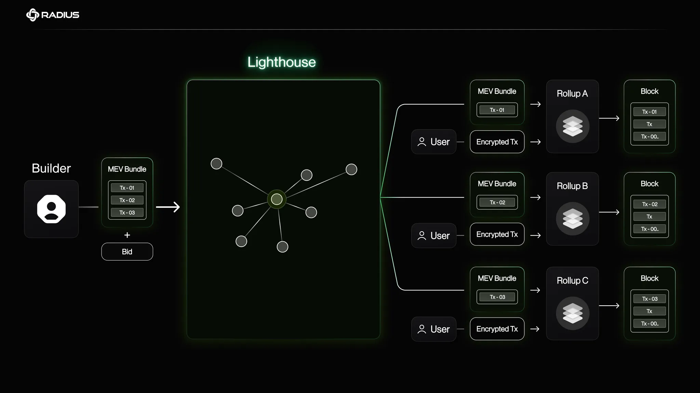

# Architecture

<figure><figcaption>
Figure 1. Secure Block Building (SBB) Architecture
</figcaption></figure>

1. A user submits either an **encrypted** or **plaintext** transaction to the `Tx_Orderers` via **Secure-RPC**.
2. The **public key** generated by the DKG (operated by Radius) is shared with Secure-RPC.
3.  The transaction is encrypted using this public key and delivered to one of the available `Tx_Orderers`.

    > There are multiple Tx\_Orderers: one serves as the lead `Tx_Orderer`, while the others verify the leader’s results.
4.  The lead `Tx_Orderer` aggregates transactions, appends them to its transaction list, and returns **order commitments**—a preconfirmation of each transaction’s position in the batch.

    > Since **commitments are made before decryption**, the lead `Tx_Orderer` has no visibility into transaction contents or value, eliminating incentives for frontrunning or reordering.
5. Once the timelock puzzle is solved, the corresponding **private key** is delivered to the `Tx_Orderers`. The lead `Tx_Orderer` then decrypts the transactions and adds them to the mempool.
6. When the rollup initiaties block building based on a new fork choice, the lead `Tx_Orderer` sends decrypted user transaction list (Top of Block, or ToB) to the searcher.
7. The searcher constructs an MEV bundle (Bottom of Block, or BoB) using the ToB as reference, and sends it back to the Tx\_Orderer.
8. The lead `Tx_Orderer` stores the transactions inside the MEV Bundle into the mempool while preserving the order between ToB and BoB.

