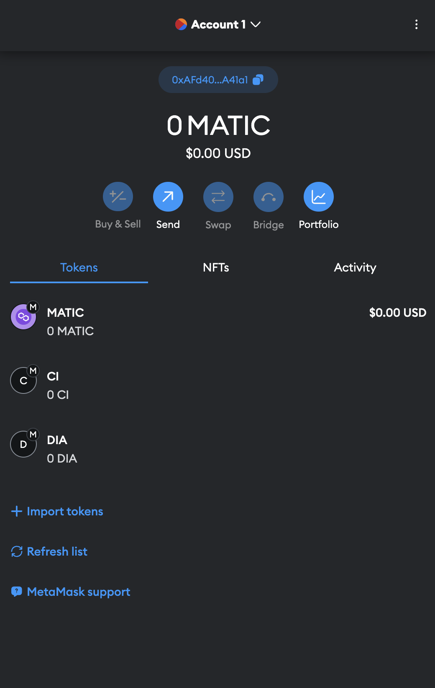
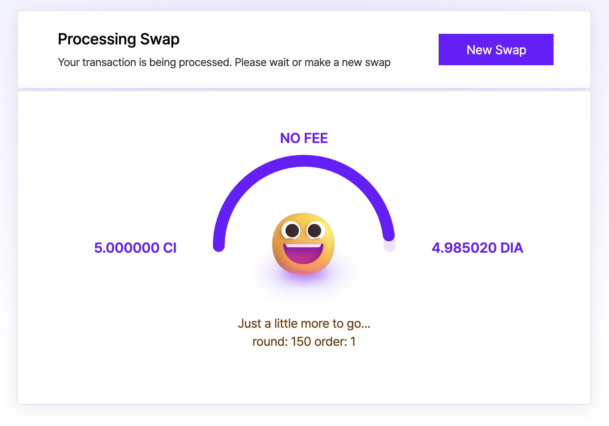
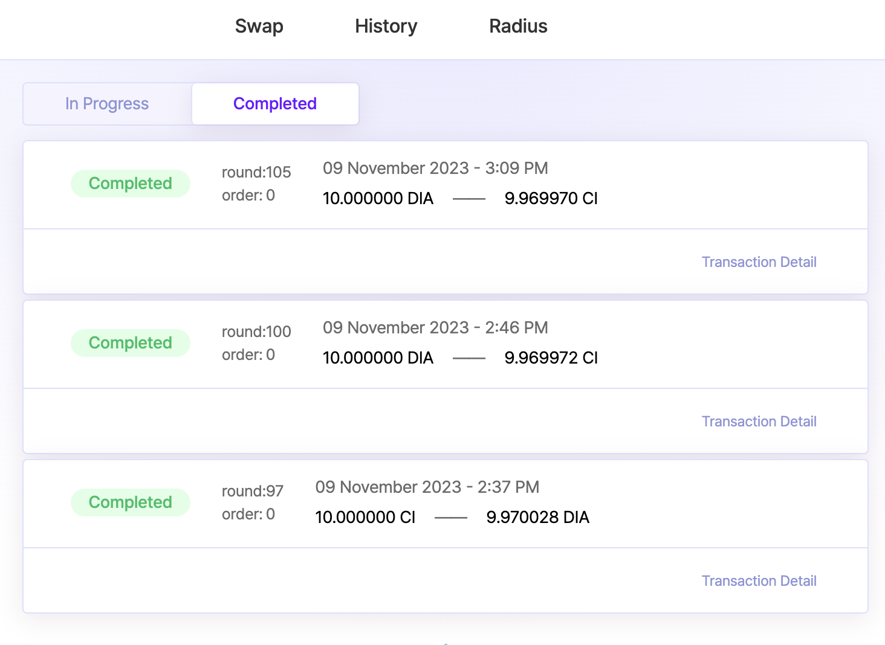

# Testnet Guide

### Getting Started

This guide will walk you through the process of interacting with Curie Testnet.

To get started, make sure you have MetaMask installed, added the Polygon Mumbai Network, and test tokens in your wallet.

1. **Install MetaMask:** Install the [MetaMask](https://MetaMask.io/) wallet extension in your browser.
2. **Add Network:** For this testnet, we use Polygon Mumbai Network.
   1. In MetaMask, click on the network selection icon in the upper left corner and choose `Add network`.
   2. Select `Add a network manually`.
   3. Enter the following fields and click `Save`.
      * Network Name: **Matic Mumbai**
      * New RPC URL: [https://rpc-mumbai.maticvigil.com/](https://rpc-mumbai.maticvigil.com/)
      * Chain ID: **80001**
      * Currency Symbol: **MATIC**
      * Block Explorer URL: [https://mumbai.polygonscan.com/](https://mumbai.polygonscan.com/)

<figure><figcaption></figcaption></figure>

4. Once added successfully, you will be switched to Polygon Mumbai Network.

### Request **and Add Testnet Tokens**

1. **Requesting Testnet Tokens**: To request testnet tokens, submit your MetaMask wallet address using this [form](https://7r9olam1w6v.typeform.com/to/k3fkrwY6). We will send you a set of test tokens: CI and DIA.
2.  **Adding CI and DIA Test Tokens to MetaMask:** On MetaMask, click `+ Import Tokens`.

    Enter the following fields:

    Token contract address: **0x0B9373fe8F12df3bBE2342336a20C4D26cb695F2**

    Token symbol: **CI**

    Token contract address: **0xB5D73C9864223197AD8A1de1e743064D340670c7**

    Token symbol: **DIA**

<figure><figcaption></figcaption></figure>

Once added, you should see the tokens listed in your wallet. Please allow up to 24 hours to receive your tokens via the faucet. Happy testing!

<figure><figcaption></figcaption></figure>

###

### Start Testing

To begin testing, follow these steps:

1. Visit the Testnet page.
2. Connect your MetaMask wallet.
3. Select either CI or DIA token and enter a swap amount. Make sure the entered amount is less than your token balance.
4. Select the other token and `Request approval`. Sign on MetaMask to approve.
5. Once approved, go back to Curie then click `Swap`. Sign again on MetaMask.
6.  While the swap is processing, you'll see a **round and order number** (See Image). This indicates where the transactions will be placed in the bundle.

    <figure><figcaption></figcaption></figure>
7. After the swap is completed, a green check mark will pop up in the bottom right corner. Head to **History** and **Completed** section, where you can confirm the same commitment number was processed as promised.

<figure><figcaption></figcaption></figure>

### **Trustless Sequencing and Fast Pre-confirmation**

Users encrypt transactions to prevent the sequencer from manipulating the transaction order. To ensure a secure and trustless process, we use cryptography and zero-knowledge proofs to verify the integrity of the encryption.

The **round** and **order numbers** shown indicate where the transactions will be placed in the bundle for fast pre-confirmations and transaction inclusion guarantee in the order determined by the sequencer.

To verify that the transactions were ordered properly, we suggest having multiple testers swap simultaneously and checking each other’s order numbers.

We also have a demonstration of how proofs are submitted to DA layer in this [video demo](https://twitter.com/radius\_xyz/status/1659582423053783042), reducing data availability costs for transaction order validation.

