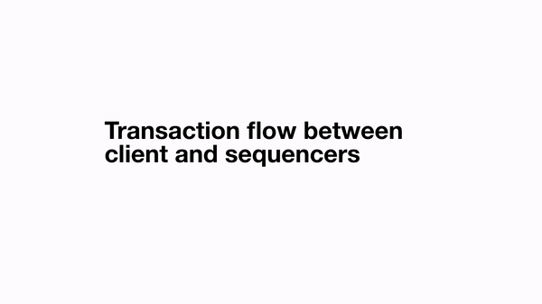
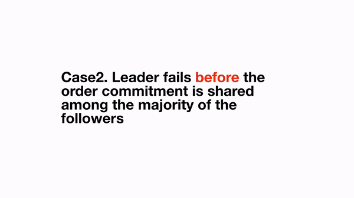
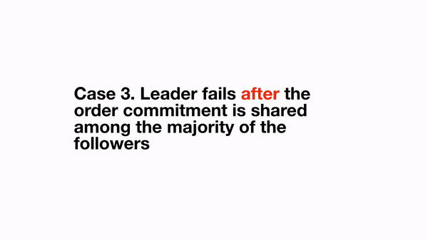
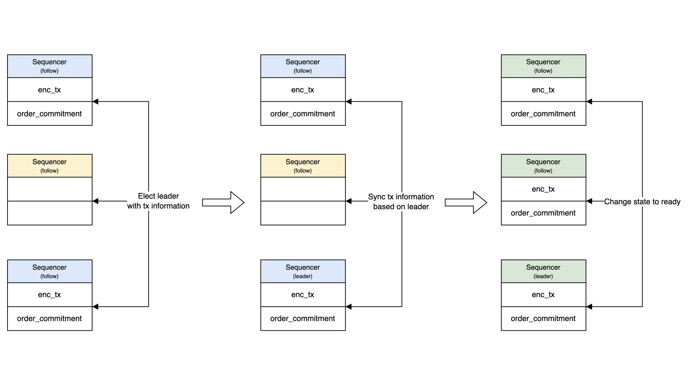
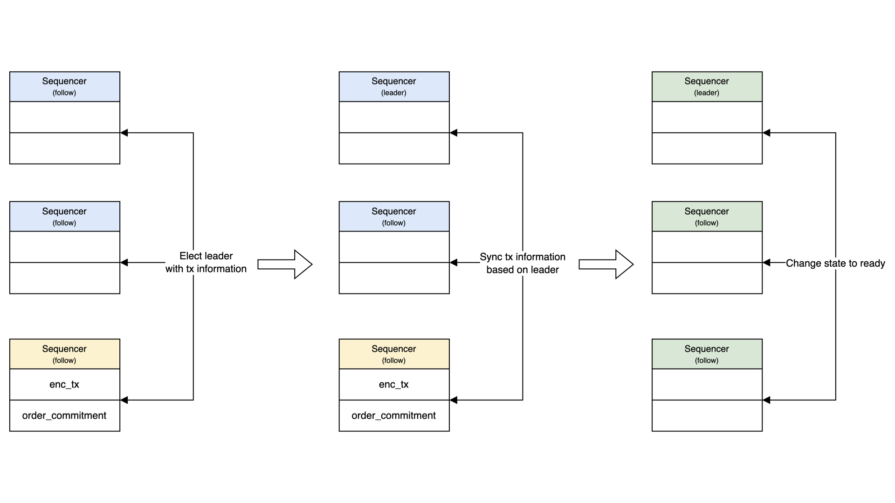

# Fault-tolerant

A key advantage of distributed systems is their fault tolerance. In the Radius sequencing layer, because the main actions requiring consensus depend on the leader, there needs to be a robust mechanism in place. This mechanism should ensure the system's liveness by quickly recovering a new leader and synchronizing the data across the other nodes to maintain continuous operation even in the event of a leader failure.

### There are cases of transaction flow:

#### Case 1: Normal flow

<figure><figcaption>
<em>Well-functioning leader</em>
</figcaption></figure>

#### Case 2: Failed to deliver order commitment to majority of the followers

<figure><figcaption>
<em>Fail before syncing with majority</em>
</figcaption></figure>

#### Case 3: Failed after successfully delivering the order commitment to the majority of the followers

<figure><figcaption>
<em>Fail after syncing with majority</em>
</figcaption></figure>

## Leader election 

In scenarios where the leader fails, rapid recovery and election of a new leader are critical. Unlike the original RAFT algorithm, which primarily considers the terms of the candidates in the leader election process, Radius introduces an additional significant factor: the state containing order-commitments.

Here's how the leader election process works in Radius when a leader fails:

1. **Transitioning to the candidate state**: The node that times out first declares itself as a candidate and solicits votes from other nodes.
2. **Vote Request and Comparison**: When a node receives a vote request, it compares its own state with that of the requesting node's state.
   * **If the states match**, the node resets its own timeout and casts its vote for the requesting node.
   * **If the states do not match**, the node abstains from voting. Upon reaching its own timeout, it then declares itself as a candidate and the process starts over from step 1.
3. **Leader election**: The node that secures more than half of the votes becomes the leader and periodically sends out heartbeats to indicate its active status.
4. **Heartbeat Reception and Timeout Reset**: Nodes receiving heartbeats verify their leader status and reset their timeouts accordingly.

This enhanced election process in Radius ensures that the system can quickly recover from leader failures while taking into account the synchronization of order-commitments, thereby maintaining the integrity and continuity of the distributed system.

This mechanism ensures that only candidates who share the majority's common state can assume leadership. This is crucial because user protection is a top priority for Radius. Consequently, the selection of a new leader indirectly depends on whether users have received their order-commitments. To achieve this, Radius has put a specific strategy in place.

The process involves the leader signing the order-commitment and distributing it to half of the nodes before it reaches the user. This approach can lead to two potential scenarios in the event of the leader's failure:

1. **Leader Fails After Distribution Completion**:
   * The order-commitment has been disseminated among the majority of followers and the user. Consequently, only a candidate who has received the most current order-commitment will be eligible for leadership. This ensures continuity and acknowledges the transactions that have been adequately communicated.
2. **Leader Fails Before Distribution Completion**:
   * The order-commitment could not be circulated among the majority of followers nor the user. In this case, only a candidate lacking the latest order-commitment will ascend to leadership. This precaution ensures that no user's transaction is incorporated into the block without the user's acknowledgment of their order.

This mechanism safeguards the integrity of transactions and user notifications, ensuring that the system remains transparent and reliable even amidst leadership transitions. The following image illustrates the process of electing a leader:

<figure><figcaption>
<em>State based voting</em>
</figcaption></figure>

Every node can vote for a candidate that matches its own data state. Consequently, the only node that can become the leader is the one that aligns with the majority's data state, as it will receive the majority of votes. In the given scenario, nodes possessing the most recent encrypted transaction and order commitment are eligible for a maximum of 3 votes, indicated by blue arrows. On the other hand, nodes lacking this information can receive a maximum of 2 votes, denoted by red arrows.

## Syncing

Upon the election of a leader, it shares its state with the followers, who then synchronize their states to match that of the leader. This synchronization process ensures consistency across the network:

1. **If the Leader Has the Latest Transactions and Order-Commitments**: Followers update their states to reflect the leader's state, ensuring that the entire network is consistent and up-to-date with the latest transactions and commitments.

<figure><figcaption>
<em>Case 1: Order commitment has been shared among the majority</em>
</figcaption></figure>

2. **If the Leader Lacks the Latest Transactions and Order-Commitments**: Followers disregard the most recent transaction and order-commitment information received from the leader. This step is crucial to maintain the integrity of the network, ensuring that only verified and acknowledged transactions are processed and included in the block.

<figure><figcaption>
<em>Case 2: Order commitment has not been shared among the majority</em>
</figcaption></figure>

This mechanism ensures that the network remains robust and consistent, aligning the states of all nodes with the elected leader's state, whether it includes the latest transactions and commitments or necessitates a rollback to maintain network integrity.
